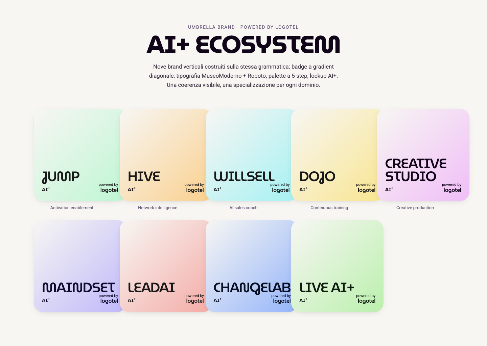

# AI+ Ecosystem · Design System

Il design system dell'umbrella brand **AI+ Ecosystem** di Logotel S.p.A.,
estratto dal pacchetto sorgente `AI+_ECOSYSTEM.ai` (Adobe Illustrator) e
trasformato in token, CSS e componenti pronti all'uso.

Nove brand verticali — **JUMP, HIVE, WILLSELL, DOJO, CREATIVE STUDIO,
MAINDSET, LEADAI, CHANGELAB, LIVE AI+** — costruiti sulla stessa
grammatica visiva (badge a gradient diagonale 135°, tipografia
MuseoModerno + Roboto, lockup `AI+` e `powered by logotel`).



> Anteprima: apri `examples/index.html` nel browser.

## Cosa c'è dentro

```
ai-plus-ecosystem-ds/
├── tokens/                  Design tokens in JSON (W3C-style)
│   ├── ecosystem.json       Token condivisi (neutrali, type, spacing, ...)
│   ├── index.json           Indice dei 9 brand
│   └── brands/<slug>.json   Token per brand
├── styles/                  CSS pronto al consumo
│   ├── tokens.css           Custom property condivise
│   ├── typography.css       @font-face e classi semantiche
│   ├── components.css       .ds-hero, .ds-badge, .ds-button, ...
│   ├── brands/<slug>.css    Override delle custom property per brand
│   └── index.css            Entry-point unico (importa tutto)
├── tailwind/preset.js       Tailwind preset brand-aware
├── fonts/                   MuseoModerno + Myriad Pro (originali pacchetto)
├── assets/
│   ├── badges/<slug>.png    Badge AI+ renderizzati (9 file)
│   ├── glass-logos/<slug>.png  Glass logos 3D (9 file)
│   └── reference-images/    Foto di reference dell'Illustrator
├── examples/                HTML pronti, uno per brand + index umbrella
├── docs/
│   ├── brands.md            Indice e quick reference dei 9 brand
│   ├── brands/<slug>.md     Spec dettagliata per brand
│   ├── typography.md
│   ├── color.md
│   └── usage.md             Come consumare il sistema
└── scripts/                 Generatori (token, examples, docs)
```

## Quick start

### Anteprima locale

```bash
git clone <questo-repo>
cd ai-plus-ecosystem-ds
python3 -m http.server 8000
# apri http://localhost:8000/examples/index.html
```

### Vanilla HTML

```html
<html data-brand="creative-studio">
<head>
  <link href="https://fonts.googleapis.com/css2?family=MuseoModerno:wght@300..700&family=Roboto:wght@300..700&display=swap" rel="stylesheet">
  <link rel="stylesheet" href="styles/index.css">
</head>
<body>
  <header class="ds-hero">
    <h1 class="ds-hero__title">Produci creatività alla velocità degli algoritmi.</h1>
  </header>
</body>
</html>
```

Cambia il brand modificando `data-brand="..."` (`jump`, `hive`,
`willsell`, `dojo`, `creative-studio`, `maindset`, `leadai`,
`changelab`, `liveai-plus`).

### Tailwind

```js
// tailwind.config.js
import preset from "./tailwind/preset.js";
export default { presets: [preset], content: ["./app/**/*.tsx"] };
```

```tsx
<div data-brand="willsell">
  <h1 className="font-display text-display uppercase text-brand-ink-deep">
    Allena i tuoi venditori.
  </h1>
</div>
```

### Solo i token

```js
import tokens from "ai-plus-ecosystem-ds/tokens/ecosystem.json";
import creativeStudio from "ai-plus-ecosystem-ds/tokens/brands/creative-studio.json";
```

## I 9 brand a colpo d'occhio

| Brand | Hue | Soft | Primary | Spec |
|---|---|---|---|---|
| **JUMP** | mint | `#BEF6D3` | `#56E3B0` | [→](docs/brands/jump.md) |
| **HIVE** | amber | `#FAD08E` | `#FDB84B` | [→](docs/brands/hive.md) |
| **WILLSELL** | cyan | `#A6F1F3` | `#06CBD2` | [→](docs/brands/willsell.md) |
| **DOJO** | yellow | `#F9E590` | `#FBD947` | [→](docs/brands/dojo.md) |
| **CREATIVE STUDIO** | magenta | `#F0BEF7` | `#D464F0` | [→](docs/brands/creative-studio.md) |
| **MAINDSET** | violet | `#BFB8FA` | `#968CFF` | [→](docs/brands/maindset.md) |
| **LEADAI** | coral | `#F4ABA6` | `#F2746F` | [→](docs/brands/leadai.md) |
| **CHANGELAB** | blue | `#95B5FA` | `#568BFF` | [→](docs/brands/changelab.md) |
| **LIVE AI+** | lime | `#BBF0AD` | `#95EC80` | [→](docs/brands/liveai-plus.md) |

## Documentazione

- [`docs/brands.md`](docs/brands.md) — indice brand + selezione brand
- [`docs/typography.md`](docs/typography.md) — MuseoModerno + Roboto, type scale
- [`docs/color.md`](docs/color.md) — neutrali, brand-aware, gradient
- [`docs/usage.md`](docs/usage.md) — come integrare in vanilla / Tailwind / token
- [`CLAUDE.md`](CLAUDE.md) — istruzioni per AI tools (Claude Code, Cursor, ecc.)

## Sorgenti

Estratto da:

- `AI+_ECOSYSTEM.ai` (180 MB, Adobe Illustrator, 1920×1080 RGB)
- Pacchetto `AI+_ECOSYSTEM_PACCHETTO/` (font + reference images + resoconto)

Brand sheet di riferimento (pagine 4 e 5 del PDF originale): JUMP e
WILLSELL contengono palette a 5 step, type specimen e mockup. Le
restanti 7 brand condividono la stessa griglia, con sole varianti di hue.

## Licenza

Asset, font e marchi: © Logotel S.p.A. Codice del design system: MIT (vedi `LICENSE`).

## Powered by

`AI+ Ecosystem` · Logotel S.p.A.
