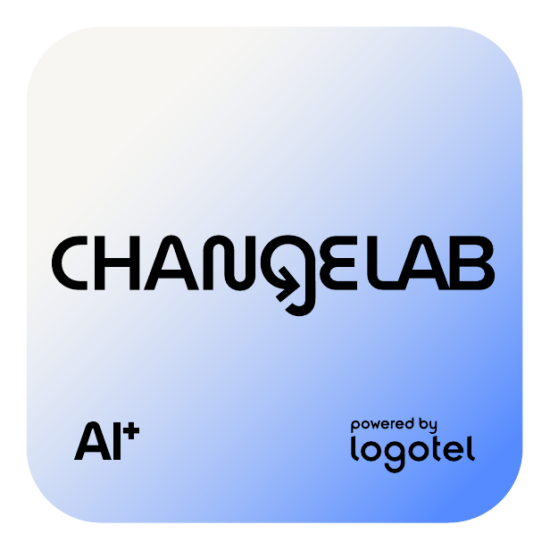

# REFRAMING LAB

> Cambiamento progettato come un esperimento.

**Slug:** `changelab` · **Hue:** blue



## Token chiave

| Token | Valore | Uso |
|---|---|---|
| `--brand` | `#568BFF` | Colore brand saturato. Fill principale, accenti, link attivi |
| `--brand-soft` | `#95B5FA` | Versione tenue. Sfondi card, hover, badge |
| `--brand-deep` | `#004EF9` | Per emphasis su sfondo light |
| `--brand-ink` | `#0F1B3A` | Charcoal con undertone brand. Testo headline su light |
| `--brand-ink-deep` | `#080F22` | Quasi-nero per body |

## Gradient

```css
/* Badge (135°) */
background: linear-gradient(135deg, #F7F6F3 0%, #95B5FA 100%);

/* Hero (160°) */
background: linear-gradient(160deg, #F7F6F3 0%, #95B5FA 55%, #568BFF 100%);

/* Ink card (verticale) */
background: linear-gradient(180deg, #0F1B3A 0%, #080F22 100%);
```

## Uso rapido

```html
<!-- Imposta il brand sull'<html> o su qualsiasi wrapper -->
<html data-brand="changelab">
  <link rel="stylesheet" href="styles/index.css" />
  ...
  <header class="ds-hero">
    <div class="ds-hero__eyebrow">eyebrow · powered by Logotel</div>
    <h1 class="ds-hero__title">Cambiamento progettato come un esperimento.</h1>
  </header>
  ...
</html>
```

```jsx
// Tailwind preset esposto in tailwind/preset.js
<header className="bg-brand-hero text-brand-ink-deep p-16 rounded-card">
  <h1 className="font-display text-display uppercase tracking-tight">
    Cambiamento progettato come un esperimento.
  </h1>
</header>
```

## Asset

- `assets/badges/changelab.png` — badge AI+ (1:1, 616x616)
- `assets/glass-logos/changelab.png` — glass logo 3D
- `tokens/brands/changelab.json` — tutti i token in formato design-tokens
- `styles/brands/changelab.css` — custom property pronte all'uso

## Quando usare REFRAMING LAB

`Cambiamento progettato come un esperimento.` — questo brand serve i casi d'uso che richiedono questo
posizionamento specifico. Per tutto il resto dell'ecosistema, vedi [`../brands.md`](../brands.md).
