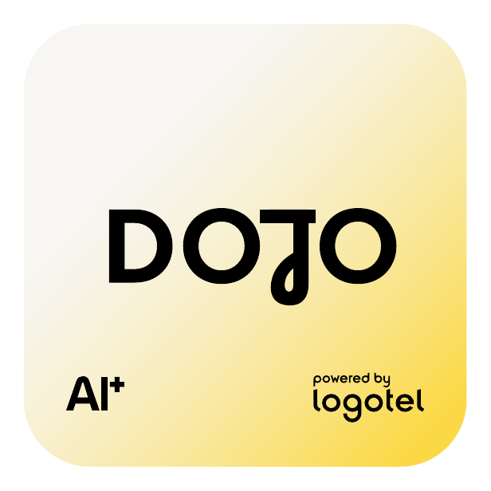

# DOJO

> Allenamento continuo guidato dall'AI.

**Slug:** `dojo` · **Hue:** yellow



## Token chiave

| Token | Valore | Uso |
|---|---|---|
| `--brand` | `#FBD947` | Colore brand saturato. Fill principale, accenti, link attivi |
| `--brand-soft` | `#F9E590` | Versione tenue. Sfondi card, hover, badge |
| `--brand-deep` | `#E1B805` | Per emphasis su sfondo light |
| `--brand-ink` | `#33301A` | Charcoal con undertone brand. Testo headline su light |
| `--brand-ink-deep` | `#181818` | Quasi-nero per body |

## Gradient

```css
/* Badge (135°) */
background: linear-gradient(135deg, #F7F6F3 0%, #F9E590 100%);

/* Hero (160°) */
background: linear-gradient(160deg, #F7F6F3 0%, #F9E590 55%, #FBD947 100%);

/* Ink card (verticale) */
background: linear-gradient(180deg, #33301A 0%, #181818 100%);
```

## Uso rapido

```html
<!-- Imposta il brand sull'<html> o su qualsiasi wrapper -->
<html data-brand="dojo">
  <link rel="stylesheet" href="styles/index.css" />
  ...
  <header class="ds-hero">
    <div class="ds-hero__eyebrow">eyebrow · powered by Logotel</div>
    <h1 class="ds-hero__title">Allenamento continuo guidato dall'AI.</h1>
  </header>
  ...
</html>
```

```jsx
// Tailwind preset esposto in tailwind/preset.js
<header className="bg-brand-hero text-brand-ink-deep p-16 rounded-card">
  <h1 className="font-display text-display uppercase tracking-tight">
    Allenamento continuo guidato dall'AI.
  </h1>
</header>
```

## Asset

- `assets/badges/dojo.png` — badge AI+ (1:1, 616x616)
- `assets/glass-logos/dojo.png` — glass logo 3D
- `tokens/brands/dojo.json` — tutti i token in formato design-tokens
- `styles/brands/dojo.css` — custom property pronte all'uso

## Quando usare DOJO

`Allenamento continuo guidato dall'AI.` — questo brand serve i casi d'uso che richiedono questo
posizionamento specifico. Per tutto il resto dell'ecosistema, vedi [`../brands.md`](../brands.md).
